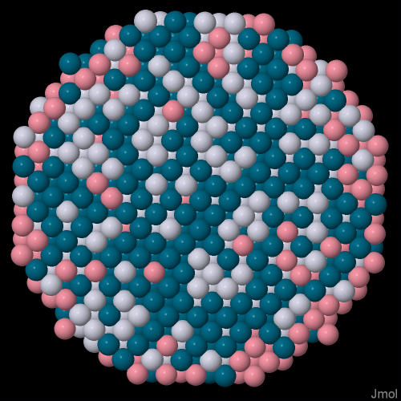
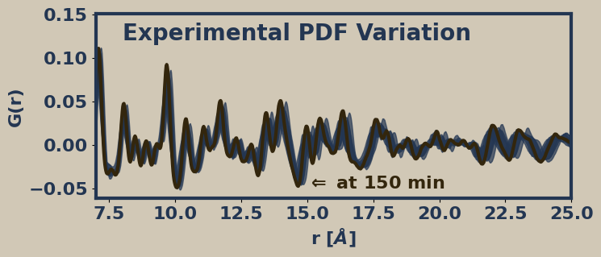

# Scientific Project: Structural and Atomic Distribution Analysis of Ternary Nanoparticles

Welcome to the repository for my thesis project, focused on the structural and atomic distribution analysis of ternary nanoparticles. This project is part of a scientific research effort to better understand the properties and behaviors of nanoparticles with various atomic arrangements and his impact on the pair distribution function.

## Project Overview

This repository contains simulation data, analysis scripts, and documentation generated throughout the research process. The organization of files reflects the experimental workflow and iterative nature of scientific investigation.

## Repository Structure

- **Results Files**: Data from simulations and experiments at different research stages.
- **Python Scripts**: Tools for data analysis and processing.
- **Jupyter Notebooks**: Visualizations and comparative studies of simulation results.
- **Simulation Folders (by Month)**: 
  - **02_xx...**: Simulations of nanoparticles with different crystal structures (FCC, BCC, HCP).
  - **03_xx...**: Simulations of core-shell, Janus, sandwich structures, and radial Pt-Ni distributions.
  - **04_xx...**: Simulations for Pt-Pd-Co nanoparticles with various internal atomic distributions and comparative analysis.
  - **05_xx...**: Simulations exploring parameter variations (temperature, scaling) for selected atomic models.
  - **06_xx...**: Atomic density measurements for simple cubic crystals, comparing atomic density ρ(r) with the pair distribution function G(r).
- **before_work**: Legacy files and scripts from earlier project stages (not essential for current research).
- **examples**: Sample simulation files and scripts for reference and reproducibility.
- **LAMMPS**: Input files, libraries, and potentials for LAMMPS molecular dynamics simulations.
- **myfunctions**: Custom Python functions for data analysis and processing.
- **paper**: Notes and corrections related to the scientific paper derived from this thesis.
- **PDF**: Python and Fortran scripts for pair distribution function (PDF) calculations. Fortran versions are recommended for better performance. The `runner.py` script automates PDF analysis using Fortran scripts.

## Important Notes

- Fortran scripts require `gfortran` for compilation.
- Some Python scripts (e.g., those named "core_shell") are not included due to authorship and licensing restrictions.

## Useful Tools

The repository provides resources for:
- Data processing and cleaning
- Graph generation and visualization
- Structural and model comparison

## License

This project is licensed under the Creative Commons Attribution 4.0 International (CC BY 4.0). See the [LICENSE](LICENCE.md) file for details.

## Contact

For questions or collaboration opportunities, please feel free to reach out.
## Acknowledgments
This project was made possible with the support of:
- My academic advisor and colleagues for their guidance and support.
- A laptop with a ryzen 5 3500u processor, 16 GB of RAM, and un chingo de tiempo libre.