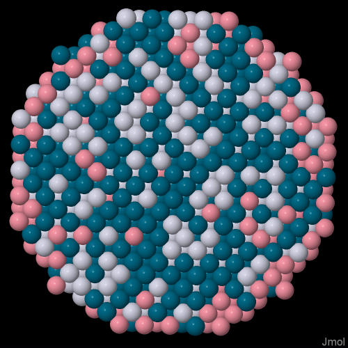
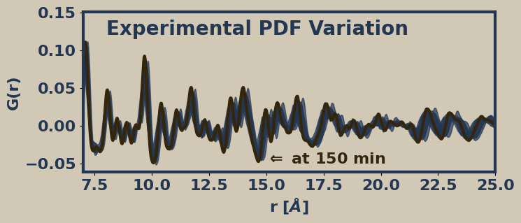

# Scientific Project: Structural and Atomic Distribution Analysis of Ternary Nanoparticles

Welcome to the repository for my thesis project, focused on the structural and atomic distribution analysis of ternary nanoparticles. This project is part of a scientific research effort to better understand the properties and behaviors of nanoparticles with various atomic arrangements and his impact on the pair distribution function.



## Project Overview

This repository contains simulation data, analysis scripts, and documentation generated throughout the research process. The organization of files reflects the experimental workflow and iterative nature of scientific investigation.

## Setup and Installation

### Creating the Environment

#### Using Conda (Recommended)
```bash
conda env create -f environment.yml
conda activate thesis-nanoparticles
```

#### Using pip + venv
```bash
python -m venv venv
# On Windows:
venv\Scripts\activate
# On Linux/Mac:
source venv/bin/activate

pip install -r requirements.txt
```

### Compiling Fortran (Optional but Recommended)

For high-performance RDF calculations:
```bash
cd src/fortran
gfortran -o rdf rdf.f90
```

## Directory Structure (Reorganized)

The project has been reorganized into a modular structure to improve maintainability and clarity:

### Core Directories

- **`src/`**: Source code
  - **`scripts/`**: Python scripts for running simulations and analysis
    - `runner.py`: Automated script runner
    - `sandwichmachine.py`: Creates Janus, sandwich, and core-shell structures
    - `rdf_runner.py`: Radial distribution function calculations
    - `randomize.py`: Random atomic distribution generator
    - `dist_graphs.py`: Distribution visualization tools
  - **`utils/`**: Utility modules
    - `tools.py`: General utility functions for XYZ file manipulation
  - **`fortran/`**: Fortran source files
    - `rdf.f90`: Radial distribution function (RDF) calculator (recommended for performance)
  - **`my_functions/`**: Additional function libraries (legacy code, maintained for compatibility)
    
- **`notebooks/`**: Jupyter notebooks for data analysis and visualization
  - **`comparision/`**: Notebooks comparing different atomic arrangements (core-shell, Janus, sandwich)
  - **`crystal_structures/`**: Notebooks analyzing crystal structures (FCC, BCC, HCP, ICO)
  - **`mathematica/`**: Mathematica notebooks for specialized calculations
  
- **`data/`**: Data files
  - **`raw/`**: Raw input files (`.xyz` atomic coordinates, `.ini` LAMMPS initial configurations)
  - **`lammps_resources/`**: LAMMPS simulation resources
    - Potential files (`.pot`, `.meam`)
    - Template input files
    - Configuration files
    
- **`results/`**: Output files and generated results
  - `graphics_*/`: Visualization outputs
  - `shells_*/`: Shell-by-shell analysis data
  
- **`external/`**: External libraries or code not authored by me
  - `core_shell_f.py`: External core-shell generation library

### Legacy Directories (Preserved for Reference)

Each legacy directory contains its own README.md explaining its purpose and contents:

- **`02_xx_crystal_structures/`**: Early crystal structure simulations (FCC, BCC, HCP, ICO)
- **`03_15_2024_Pt_Ni_rand_dist/`**: Random and radial distribution experiments for Pt-Ni systems
- **`03_xx_2024_janus_coreshell_sandwich/`**: Core-shell, Janus, and sandwich structure development
- **`04_12_2024_random_dist_2/`**: Second iteration of random distribution methodologies
- **`04_19_2024_radial_distributions/`**: Systematic radial distribution models (M0-M8)
- **`04_26_2024_comparision_variables/`**: Parameter sensitivity and χ² statistical analysis
- **`05_17_2024_probes_w_last_model/`**: Final model validation with multiple probes
- **`05_31_2024_probes_w_temp_vac/`**: Temperature and vacuum condition effects
- **`06_23_2024_crystal_density_aprox/`**: Theoretical ρ(r) vs G(r) comparison for perfect crystals
- **`before_work_2/`** & **`before_work_3/`**: Early exploratory work (legacy)
- **`examples/`**: Reference examples and templates
- **`paper/`**: Publication notes and corrections
- **`PDF/`**: Legacy Python PDF calculators (superseded by Fortran in `src/fortran/`)

## Important Notes

- Fortran scripts require `gfortran` for compilation
- The `core_shell_f.py` in `external/` is not authored by me and is kept separate
- XYZ files contain atomic coordinates and can be large - avoid opening in text editors

## Usage

### Running Scripts

Scripts are located in `src/scripts/`. Run them from the project root directory:

```bash
# Example: Create a sandwich structure
python src/scripts/sandwichmachine.py <input.xyz> sandwich <z1> <z2>

# Example: Run RDF analysis
python src/scripts/rdf_runner.py <input.xyz>

# Example: Automated analysis runner
python src/scripts/runner.py
```

### Compiling Fortran Code

For better performance, compile and use the Fortran RDF calculator:

```bash
cd src/fortran
gfortran -o rdf rdf.f90
./rdf <input.xyz>
```

### Working with Notebooks

Start Jupyter from the project root:

```bash
jupyter lab
```

Navigate to `notebooks/` to explore:
- Comparative studies of different nanoparticle structures
- Crystal structure analysis
- Visualization of pair distribution functions

## Dependencies

- **Python 3.x**
- **NumPy**: Array operations and numerical computing
- **Matplotlib** (for notebooks): Plotting and visualization
- **LAMMPS**: Molecular dynamics simulations
- **Jupyter**: Interactive notebooks
- **gfortran**: Fortran compiler (for RDF calculations)

## License

This project is licensed under the Creative Commons Attribution 4.0 International (CC BY 4.0). See the [LICENSE](LICENCE.md) file for details.

## Contact

For questions or collaboration opportunities, please feel free to reach out.
## Acknowledgments
This project was made possible with the support of:
- My academic advisor and colleagues for their guidance and support.
- A laptop with a ryzen 5 3500u processor, 16 GB of RAM, and un chingo de tiempo libre.